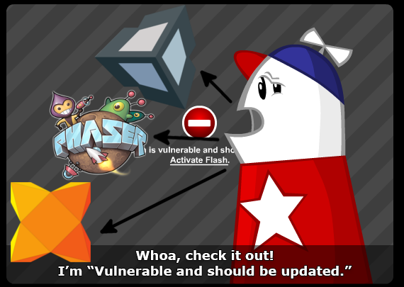
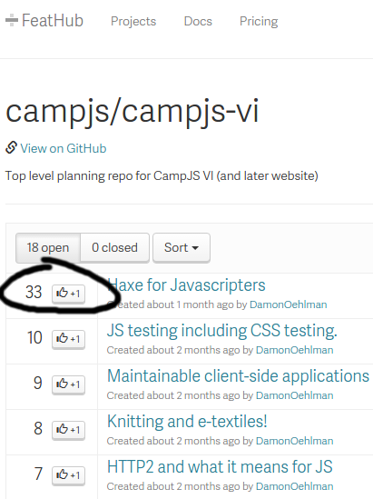
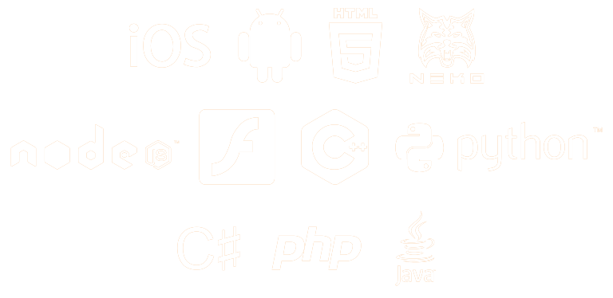
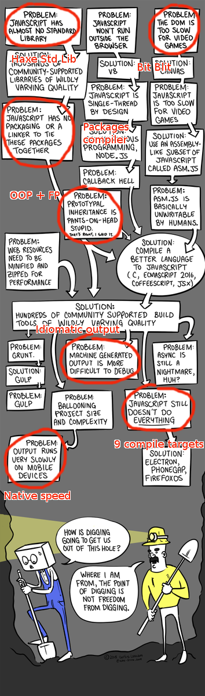

# Haxe for Javascripters <!-- .element: id="first" -->


Have you tried **Haxe** yet?

Brendan Graetz

=SLIDE=

# Brendan Graetz <!-- .element: id="author" -->

[@bguiz](https://twitter.com/bguiz)

[bguiz.com](http://bguiz.com)


[*speaker notes*](index.md)

=SLIDE=

# Haxe


=SLIDE=

# Overview <!-- .element: id="overview" -->

- ECMAScript
- Community
- Haxe to JS
- Pros/ Cons
- Demo

=SLIDE=

# History <!-- .element: id="history" -->

=SLIDE=

The **ECMAScripts**

- ECMAScript 3
  - 1st widely implemented Javascript
- ECMAScript 4
  - Failed as a Javascript spec
  - Implemented in ActionScript 3
- ECMAScript 5
  - 2nd widely implemented Javascript
- ECMAScript 6
  - Hot off the presses
  - Now called ES2015

=SLIDE=

So ... **Haxe**?

inspired by AS3 <!-- .element: class="fragment fade-in b" data-fragment-index="1" -->

so, quite ECMAScript-ish <!-- .element: class="fragment fade-in b" data-fragment-index="2" -->

also has elements of OCaml & Java <!-- .element: class="fragment fade-in b" data-fragment-index="3" -->

take Javascript, and add types <!-- .element: class="fragment fade-in b" data-fragment-index="4" -->

Typescript, anyone? <!-- .element: class="fragment fade-in b" data-fragment-index="5" -->

=SPEAKERNOTES=

- Haxe is *not* ECMAScript compliant, it is more of a fork/ branch
  - See [this article](http://jcward.com/Haxe+Notes+For+ECMA+Coders+Object+Literal+Notation) which enumerates one of the more obvious differences
- For a Javascript developer, similar enough for most of it to feel familiar
- ES6/ ES7 features are not planned to be implmented, hwoever, many of them have already been included
  - There are macros for this, if you *really* want to

=SUBSLIDE=

Comparing TypeScript and Haxe - which is the better compile to Javascript language?

[TypeScript vs Haxe](http://blog.onthewings.net/2015/08/05/typescript-vs-haxe/)
(Andy Li)

Looking at the Haxe to Javascript compiler in detail

[Vanilla Haxe JS](http://philippe.elsass.me/2014/11/vanilla-haxe-js/)
(Phillipe Elsass)

=SLIDE=

# Community <!-- .element: id="community" -->

=SLIDE=

Original mission

- Alternative **OSS** compiler to Flash
- Compiler written using OCaml
- Beat Adobe's own Flash compiler


=SLIDE=



[(article)](http://www.gamasutra.com/blogs/LarsDoucet/20150915/252693/Where_have_all_the_Flash_developers_gone.php)

=SLIDE=

Focus

- Due to roots, very centred around Game Dev
- LudumDare: Dominated by HaxeFlixel
- This is beginning to change now


=SLIDE=

Mentioned on haxe.io ... next minute:



=SLIDE=

Haxe Foundation

- Core contributors to the compiler and the language spec
- See @glazou's
  [critique of the Haxe foundation](http://www.silexlabs.org/quaxe-infinity-and-beyond/)
  - Controversy alert: Run like 1-man show
- Could learn from the iojs/node foundation

=SPEAKERNOTES=

- Daniel Glazman sits on one of W3C's committees, and so his opinion carries a lot of weight
- However, this talk was very polarising amongst the Haxe community, and many of them reject his point of view
- His point that large corporations will only invest in technologies that appear to be governed by a stable committee (or another corporation) still should be considered though, and seeing how NodeJs foundation has recruited comapnies to sit on its board
- Read "Regarding Haxe Foundation" in
  [this heated discussion](https://groups.google.com/d/msg/haxelang/i8iXdpK8oAc/qgUmBo5sYPEJ)

=SLIDE=

Silex Labs


- Non profit organisation that promotes OSS
- Hosts many meetups & workshops
- Organises WWX


=SPEAKERNOTES=

- Silex labs is not only focussed on Haxe, but many other languages and technologies
- Crowdfunding needed to make the conference happen

=SLIDE=

Needs more of this sort of thing


=SLIDE=

Where are Haxers now?


(trailing: rest of Europe + US)

=SLIDE=

Pourtant, toute la documentation est en Anglais

=SPEAKERNOTES=

- Yet, all the documentation is in English, which is awesome
- If I got that wrong, don't blame me - blame Google translate!

=SLIDE=

# Package Manager  <!-- .element: id="package-manager" -->

`npm` is to NodeJs ...


=SUBSLIDE=

... as `haxelib` is to Haxe ...


=SUBSLIDE=

... but `haxelib` is a bit more C-like:

`LD_LIBRARY_PATH`

(all libs installed globally by default)

=SPEAKERNOTES=

- `haxelib local` allows local installation of libraries

=SLIDE=

... and now, the **killer** feature! <!-- .element: id="cross-compile" -->

=SLIDE=

# Cross-compile



=SLIDE=

<div style="overflow: auto; max-width: 800px; max-height: 600px; ">
  
  <a href="http://cube-drone.com/comics/c/relentless-persistence">Source: Cube Drone</a>
</div>

=SLIDE=

Most languages: Language + Standard Lib <!-- .element: class="fragment fade-in b" data-fragment-index="1" -->

Haxe: Those, plus cross platform APIs <!-- .element: class="fragment fade-in b" data-fragment-index="2" -->

Transpiles to natively compile-able code <!-- .element: class="fragment fade-in b" data-fragment-index="3" -->

VMs or run times are <!-- .element: class="fragment fade-in b" data-fragment-index="4" -->
***optional*** <!-- .element: class="fragment fade-in b" data-fragment-index="5" -->

=SLIDE=

Awesome - right now:

- HTML+JS
- C++ --> iOS
- C++ --> Android NDK
- Java ( --> Android SDK )
- Flash

=SLIDE=

Awesome - eventually:

- PlayStation
- Xbox

[announcement by Lars Doucet](http://www.fortressofdoors.com/openfl-for-home-game-consoles/)

=SLIDE=

Auto-magic tooling

```bash
haxelib install openfl
haxelib run openfl setup
# Unleash the dragons!
openfl setup android
# {android,ios,html5,flash,linux,mac,windows,blackberry,tizen}
```

(Same feeling as `npm i -g react-native-cli` for the first time)

=SPEAKERNOTES=

- OpenFL is one of the more popular haxelibs out there
- It's a framework, used primarily to compile games (Flash API) that run many target devices

=SLIDE=

Andy Li's [talk at a recent London Meetup](http://youtube.com/watch?v=7__Unc5D130):

> There are over 300 transpile to Javascript languages/ platforms ...
> It is a balancing act, where you maximise the pros and minimise the cons ...
> Haxe has a very good value proposition from this point of view

(I'm paraphrasing)

=SLIDE=

| Pros | Cons |
| :--- | :--- |
| Static type checking + type inference | Lose the flexibility of object literals |
| Idiomatic JS                          | `==` instead of `===` |
| non-JS targets as well                | Transpile adds extra build step |
| Functional programming                | Classes everywhere |
| Compile-time optimisation             |  |
| Super fast compiler                   |  |
| Mature - 2005                         |  |
| Macros                                |  |

=SPEAKERNOTES=

- Haxe itself ensures strict equality, however the JS it outputs uses `==` instead of `===`
- Haxe satisfies both sides of the camp in the functional vs OOP thing, so it really is your preference
- On the matter of being used to interpreted languages. Haxe as a language has proven itself to be very extensible. JS devs who prefer to write Coffeescript might enjoy [Raxe](https://raxe.rocks/), which is Haxe with ruby-inspired syntax

=SLIDE=

| JS only | JS + Android + iOS |
| :---: | :----: |
| Typescript   | Haxe |
| Coffeescript | PhoneGap|
| many more... | React Native |
|              | NativeScript |
|              | Emscripten |
|              | GWT & LLVM |
|              | ... many more |

=SLIDE=

Cross-compilation is ***the reason*** to try Haxe

=SLIDE=

# Pros & cons  <!-- .element: id="pros-cons" -->

=SLIDE=

Khan academy recently did a comparison of

*code sharing strategies*, because:

> *"Reimplementing the same thing multiple times is error-prone, time-consuming, and demoralizing. But the cure might be worse than the disease."*

=SLIDE=

... so I felt compelled to [add a column for Haxe](https://twitter.com/bguiz/status/654551259492429824):


=SPEAKERNOTES=

- Go check out the document, some of the pros and cons listed here are there too

=SLIDE=

# Who to watch <!-- .element: id="who-to-watch" -->

=SLIDE=

People

- Haxe <--> Javascript expert
  - [Philippe Elsass](https://twitter.com/elsassph) - @elsassph
  - [Andy Li](https://twitter.com/andy_li) - @andy_li
  - [Matthijs Kamstra](https://twitter.com/MatthijsKamstra) - @MatthijsKamstra
- Super interesting articles
  - [Lars Doucet](https://twitter.com/larsiusprime) - @larsiusprime
  - [Jeff Ward](https://twitter.com/Jeff__Ward) - @Jeff__Ward

=SUBSLIDE=

Projects

- [Haxe React](https://github.com/massiveinteractive/haxe-react)
  - Haxe bindings for ReactJs
- [THX libs](http://thx-lib.org/)
  - The `underscore`/ `lodash` for Haxe

=SUBSLIDE=

Articles

- [Working with JS libs](http://philippe.elsass.me/2014/11/haxe-working-with-javascript-libraries/)
  - How to write Haxe bindings for your JS libs
- [Haxe & Object Literal Notation](http://jcward.com/Haxe+Notes+For+ECMA+Coders+Object+Literal+Notation)
  - The difference between Haxe objects and Javascript objects
- [`haxejs` book](https://matthijskamstra.github.io/haxejs/haxejs/about.html) &
  [`haxenode` book](http://matthijskamstra.github.io/haxenode/haxenode/about.html)
  - Guides to the Haxe Javascript target & using NodeJs with Haxe
- [`haxe.io`](http://haxe.io)
  - Haxe Roundup (Community news)
- [Gettings started with the JS target](http://haxe.org/manual/target-javascript-getting-started.html)
  - Official Haxe documentation

=SLIDE=

# Summary  <!-- .element: id="summary" -->

- Javascript-ish syntax
- Game Dev awesomesauce community
- Best-in-class cross compilation

=SLIDE=

# Try Haxe  <!-- .element: id="try-haxe" -->

[try.haxe.org](http://try.haxe.org/)

... like, in your browser <!-- .element: class="fragment fade-in b" data-fragment-index="1" -->

... like, right now <!-- .element: class="fragment fade-in b" data-fragment-index="2" -->

=SLIDE=

# Credits <!-- .element: id="credits" -->

- [Chris Decoster](https://twitter.com/impaler12) for reviews and feedback on this presentation
- [Andy Li](https://twitter.com/andy_li) for inspiring this talk with his

=SLIDE=

# DEMO <!-- .element: id="demo" -->

=SLIDE=

# Thank you <!-- .element: id="last" -->

Brendan Graetz

[bguiz.com](http://bguiz.com)

[@bguiz](https://twitter.com/bguiz)


=SPEAKERNOTES=
