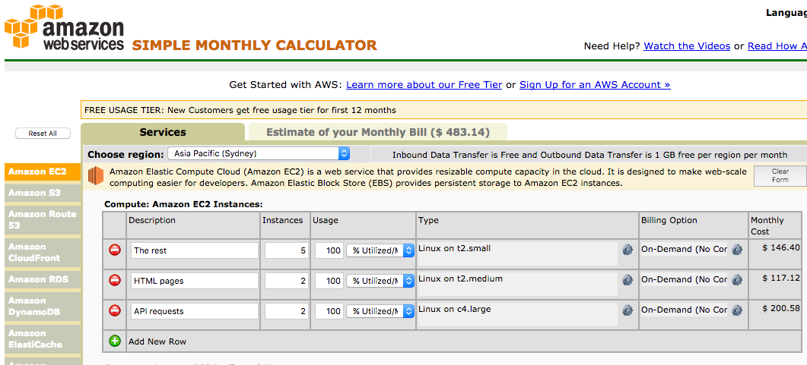
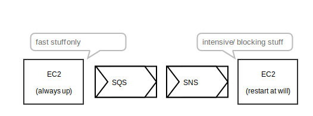
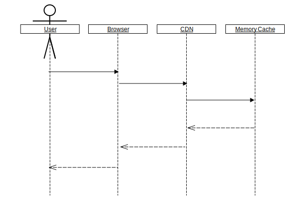
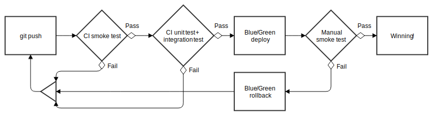

[Brendan Graetz](http://bguiz.com)

[@bguiz](https://twitter.com/bguiz)

=SLIDE=

# Deploying NodeJs Servers at Scale

## Top 7 Things Learnt

[Brendan Graetz](http://bguiz.com)

[@bguiz](https://twitter.com/bguiz)

=SLIDE=

# 2016 Olympics


- 5.x million users (60 min interval)
- 3.x million users (5 min interval)
- 1.x million users (1 min interval)

=SLIDE=

## AWS resources

- `c4.large`: 2X instances for API requests
- `t2.medium`: 2X instances for HTML pages
- `t2.small`: 3-5X instances for the rest
- 47% CPU usage peak

=SLIDE=

[... which works out to super cheap](https://aws.amazon.com/ec2/pricing/)



=SLIDE=

# 1. Server Lifetime

- Always up vs reboot at will
- Push tasks using queues (SQS + SNS)

=SLIDE=

## Delegate intensive tasks

- Always up server delegates resource intensive tasks to reboot at will servers



=SLIDE=

# 2. 3rd party APIs

- Always plan for them to fail
- Set up notification alerts for these
  - Just logging to files is insufficient
  - Learning point for us during the event

=SLIDE=

# 3. Excel at async IO

- Fail fast
- Leverage this by being as quick as possible
  - Non-blocking -> non-slow
- Understand Javascript's event loop
  - Move stuff back into the event loop ASAP

=SLIDE=

# 4. Asynchronous Javascript

- Low loads: Promises & callbacks had same performance
- High loads: Callbacks outperformed promises
  - Small but perceptible difference

=SLIDE=

## Rule of 3

- Function nest count `<= 3`
  1. Main function (route handler)
  2. Callback
  3. Nested callback

=SLIDE=

## Rule of 3

```javascript
function getFooRoute(req, res) { // <1>
  async1(req.params.id, (err, result) => { //<2>
    if (err) {
      return res.status(401).send();
    }
    async2(result, (err2, result2) => { // <3>
      if (err2) {
        return res.status(404).send();
      }
      return res.json(result2);
    });
  });
}
```

=SLIDE=

## Why 3?

- Each async action has at minimum 1 fail and 1 pass state
- **How hard** is it to reason about states?
  - 1 callback -> 2 states -> *trivial*
  - 2 callbacks -> 4 states -> *trivial*
  - 3 callbacks -> 8 states -> **hard**

=SLIDE=

## More than 3

- Function is too complex -> refactor/ rewrite
- OR: `yield` callbacks

=SLIDE=

## Koa philosophy

- Stole some ideas from `koa` routes and middleware
- *Generator functions* as the primary async mechanism
- Applied them to `express`
- *But*, without `co` & without `Promise`

=SLIDE=

## promises

- `co` lets you `yield` `Promise`s

```javascript
co(function* () {
  let result = yield myPromise;
  // do something with result
})
.catch((err) => {
  // handle error
});
```

=SLIDE=

## callbacks

- `righto` lets you `yield` callbacks

```javascript
righto.iterate(function* (reject) {
  let [err, result] = yield righto.surely(myCallback, param);
  if (err) { reject(err); return; }
  // do something with result
})((err, result) => { /* ... */ });
```

=SLIDE=

hot code


=SLIDE=

# 5. **Hot** code

- Identify it from biz rules
- Live monitoring in production
- Optimise it heavily


=SLIDE=

## **Hot** code optimisations

- Deflect work *elastically*
- Multiple levels of caching

=SLIDE=

stretch!


=SLIDE=

## Elastic Deflect (TM)

- For things that run very frequently
  - e.g. token cycling
- Stretch the interval based on volume
- Serve the same number of users with less resources
- When the volume goes back to normal,
  the interval goes back to normal too

=SLIDE=

caching


=SLIDE=

## Multiple levels of caching

- Cache everything
- Internally within the server:
  - In memory LRU cache
- On the clients (web + native mobile apps)
  - HTTP response header `Cache-Control`
- On the CDN
  - Configure to read from `Cache-Control`
- Even cache your error responses
  - (use a lower `max-age`)

=SLIDE=

## Multiple levels of caching

- Browser, then CDN, then server



=SLIDE=

optimisations


=SLIDE=

## Optimisations summary

> The fastest API request/ response times that you will ever get
> are the ones which you never need to make

=SLIDE=

devops


=SLIDE=

# 6. Blue-green deployments

- Always have two production servers running
- DNS level switch (Route53)
  - No down time
  - Smoke test in production *before* users get to it
  - Easy to roll back
- Deploy to production on day 2!

=SLIDE=

testing


=SLIDE=

# 7. Testing

- 93% code coverage
- Really gives you **confidence** in deploying
  - Confidence is necessary if deploying after **going live**
- When something breaks, **narrow down fault** definitively
  - Useful when 3rd party vendors are problematic

=SLIDE=

## Test and deploy flow

- Smoke test -> Unit & integration test -> Deploy



=SLIDE=

# Fin

- Very few fancy things
- A lot of getting the basic stuff right

=SLIDE=

# Questions?


[Brendan Graetz](http://bguiz.com)

[@bguiz](https://twitter.com/bguiz)
