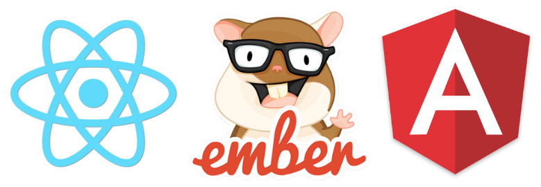
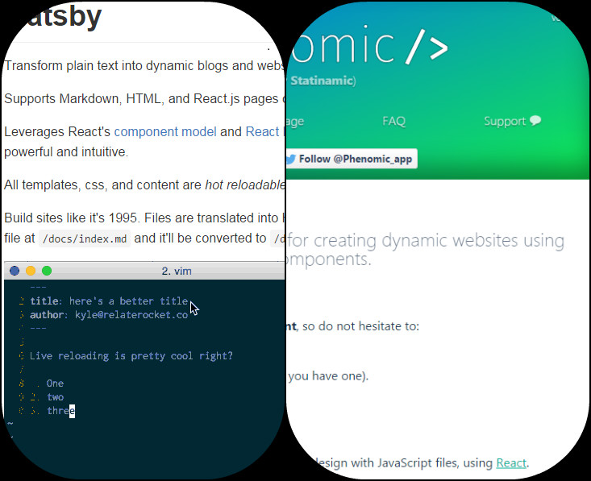
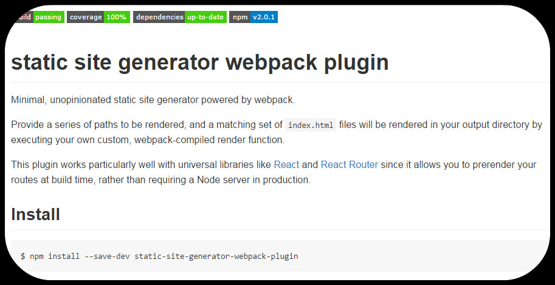
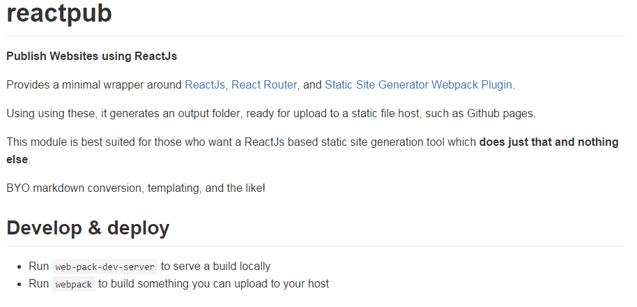

# Publish Websites with ReactJs <!-- .element: id="first" -->


**Brendan Graetz**
=SLIDE=

# Brendan Graetz <!-- .element: id="author" -->

[@bguiz](https://twitter.com/bguiz)

[bguiz.com](http://bguiz.com)


[*speaker notes*](index.md)

=SLIDE=

# Sequence


`git push -> travis -> webpack -> reactjs -> gh-pages`

=SPEAKERNOTES=

This is the big idea, the sequence that we want to achieve.

You do a git push,
travis CI detects the commit,
webpack build starts,
react and react-router used to render each page,
the folder of files that are generated get pushed to github pages
(or any other static host).

=SLIDE=


[Make your own](http://dev.to/rly)

=SPEAKERNOTES=

I came across an O'Rly "definitive guide" parody book cover generator,
and I couldn't resist making one for this presentation.

But this is in no way the definitive guide to anything,
so just ignore this really

This talk is pretty much a quick overview

=SLIDE=

Software Philosophy

`+`

Show and Tell

=SPEAKERNOTES=

This is going to be a rather brief talk.

It's going to be one part software engineering philosophy,
and one part show and tell.

=SLIDE=

# Software Philosophy <!-- .element: id="philosophy" -->

=SPEAKERNOTES=

Is the act of writing code an art or a science?

Who knows?

The question I have been pondering, however,
is much more specific,
and I kept coming back to it over and over
when creating reactpub,
and it is...

=SLIDE=

Frameworks vs Libraries


=SPEAKERNOTES=

Let's start off with furniture.
You can get your furniture all sorts of different ways.

On one end of the spectrum,
you can have blocks of wood/ metal/ etc,
and literally cut them up into pieces and make your own table.
This is like using neither a framework nor a library.

On the other end of the spectrum,
you can have the entire table pre-made.
All you have to do is buy it,
and you decide where to put it,
and perhaps what to put on it.
This is like using a framework.

Somewhere in the middle,
you have something like Ikea,
where you buy the pieces that you need to make your table,
and you get to put them together exactly like the instructions say...
but you have some room for creativity.
This is like using a library.

=SLIDE=


=SPEAKERNOTES=

It was actually a bookshelf from Ikea,
and I bought a couple of extra wooden boards,
and threw out the back board.
Now it's a shoe rack,
and it fit my needs way better than
any of the shoe racks I could find out there.
I don't have the carpentry skills good enough to put together anything really.
But given some pre-made parts I was able to make my own thing.

=SLIDE=

A framework **calls** your code

*vs*

A library is **called by** your code

=SPEAKERNOTES=

This to me is what the distinction between a framework and a library is:
who calls who.

=SLIDE=


=SPEAKERNOTES=

=SLIDE=

# Single-page apps



=SPEAKERNOTES=

Therein also lies, IMHO,
the main distinction between ReactJs and its competition,
such as AngularJs and EmberJs:
ReactJs is a library, whereas EmberJs and AngularJs are frameworks.

=SLIDE=

# M + ***V*** + C + R


=SPEAKERNOTES=

So this is a talk about publishing websites using ReactJs,
why wax all this software engineering philosophy,
you might be thinking?

=SLIDE=



=SPEAKERNOTES=

Here's why.  When I was looking for static site generators,
I found that there were already a couple of
really popular, ReactJs based, site gens out there.

But, when I looked through their code,
I found that they were actually frameworks themselves.

=SLIDE=



=SPEAKERNOTES=

Then I came across this webpack plugin,
by @markdalgleish, which was the moment of truth for me.
When I looked into its code,
I instantly knew that I could build something
that wrapped around this webpack plugin and ReactJs...
and do nothing else.

=SLIDE=



=SPEAKERNOTES=

... in fact that's exactly what I did in reactpub

=SLIDE=

My blog story


=SPEAKERNOTES=

I've been blogging for over ten years now,
and in that time I have switched from
Blogger to Wordpress to Tumblr.
Then I cottoned on to static site generation,
and I exported all my posts to as HTML files with YAML front matter,
republished them using Docpad,
and started writing new posts in markdown.

=SLIDE=


=SPEAKERNOTES=

... but I had one problem: speed.

Static site generation, as it turns out was slow.
It took me several minutes each time I wanted to update my blog.

(Which I guess is fine,
given that I only write a new post about once a month.)

But I still wanted a faster solution.

I experimented with a few more static site generators before
deciding to take the plunge and create reactpub.

=SLIDE=


=SPEAKERNOTES=

If I do not want the folding bits at the side of the table,
then I simply do not want to spend time working out how to make them.
I just want the main table.

=SLIDE=

Continuous Integration

`+`

Continuous Deployment

=SPEAKERNOTES=

Apart from speed, the other requirement that was unmet,
was continuous integration and continuous deployment.

I wanted the ability to do a git push
and then have something pick up on that,
build the site,
test the site,
and finally deploy (publish) the site.

=SLIDE=


=SPEAKERNOTES=

With reactpub, I have been able to set up CI & CD,
such that when I do a git push on my repo,
Travis picks up on that,
and invokes autodocs,
another one of my NodeJs modules,
which executes the build and test steps,
and finally publishes to Github pages.w

=SLIDE=

# Code <!-- .element: id="code" -->

=SPEAKERNOTES=

So let's take a look at some code,
very briefly!

=SLIDE=

# Setting up your website <!-- .element: id="site-setup" -->

=SPEAKERNOTES=

=SLIDE=

- webpack
- entry

=SPEAKERNOTES=

Reactpub works at its core with two different files,
that follow two separate paths.

The first is your webpack config,
and the second is the entry file,
which is eventually what gets compiled into your bundled JS.

=SLIDE=

## Chain of webpacks <!-- .element: id="chain-webpack" -->

- your-website/webpack
- theme/webpack
- reactpub/webpack

=SPEAKERNOTES=

In your website's repo,
define a webpack config that points to a theme's webpack config,
which in turn will point to reactpub's webpack config

=SLIDE=

## Chain of entries <!-- .element: id="chain-entry" -->

- your-website/entry
- theme/entry
- reactpub/entry

=SPEAKERNOTES=

In your website's repo, similarly,
define an entry file that points to the theme's entry file,
which in turn will point to reactpub's entry file

=SLIDE=

## Webpack Config <!-- .element: id="site-webpack" -->

```javascript
const themeWebpack = require('reactpub-blog-basic-theme/webpack');
let webpackConfig = themeWebpack({
  data: require('./data.js'),
});
// additional loaders & plugins
module.exports = webpackConfig;
```

=SPEAKERNOTES=

This is what a webpack config in your website might look like.
You are free to modify the webpack config that is returned, of course,
to do any extra things your website might want to do.

=SLIDE=

## Entry <!-- .element: id="site-entry" -->

```javascript
const theme = require('reactpub-blog-basic-theme');
theme.settings.set({
  data: require('./data.js'),
  config: require('./config.js'),
});
module.exports = theme.render();
```

=SPEAKERNOTES=

This is what the entry file in your websites might look like.

=SLIDE=

## npm scripts <!-- .element: id="npm-scripts" -->

```javascript
"scripts": {
  "generatedocs": "npm run generate-data && npm run build",
  "testdocs": "node ./app/got-or-not.js",
  "autodocs": "node ./node_modules/autodocs",
  "generate-data": "node ./app/generate-data.js",
  "build": "webpack --config webpack.conf.js",
  "build-server": "npm run build && http-server ./dist/ -c-1 -p51111",
  "dev-server": "webpack-dev-server --config webpack.conf.js --port 51111"
}
```

=SPEAKERNOTES=

Finally set up a few scripts in your package.json
do some npm installs, etc ... the usual stuff

=SLIDE=

# `reactpub` internals <!-- .element: id="internals" -->

=SPEAKERNOTES=

So the idea is that your website's repo only needs to be a repo
containing markdown files for your content,
plus some glue code tie tie in together with reactpub.

But let's take a look at the internals too!

=SLIDE=

## Theme Webpack <!-- .element: id="theme-webpack" -->

```javascript
const reactpubEntry = require('reactpub/entry');
const routes = require('./routes.jsx');
const data = require('./theme.js').settings.get('data');
reactpubEntry({
  reactOnClient: true,
  routes,
  routeMetadata: data,
});
```

=SPEAKERNOTES=

The theme's entry invokes the reactpub entry,
with a set of routes defined by the theme,
and data passed in from your website,
which we saw happening earlier.

The reactOnClient here is crucial.
If you want static site generation only,
then it should be false.

If you want to generate static pages,
which, once displayed in the browser,
then make ReactJs "take over",
turning it into a single-page app,
then set this to true.

=SLIDE=

## Client Render <!-- .element: id="client-render" -->

```javascript
function renderClient() {
  let history = // ... (redacted for brevity)
  var outlet = document.getElementById('outlet');
  ReactDom.render(
    <Router
      history={history}
      routes={routes}
      onUpdate={routerOnUpdate} />,
    outlet);
  console.log('ReactJs has taken over page rendering.');
}
```

=SPEAKERNOTES=

The reactOnClient flag that we saw earlier,
well that decides whether or not to invoke this function in reactpub.

This, for me at least, was a mind blowing moment,
in how simple and elegant it is to use ReactJs
to render on client and server.

This technique is employed here with statically generated pages;
when the same technique, when used on a dynamically served page,
is called isomorphic Javascript,
also known as universal Javascript
... terms that I have read many articles about before,
but never actually did.
Feels awesome when you actually pull it off!

=SLIDE=

## Server Render <!-- .element: id="render-server" -->

```javascript
ReactRouter.match({
  routes,
  location,
}, (err, redirectLocation, renderProps) => {
  ... // redacted for brevity
  let rendered = ReactDomServer.renderToStaticMarkup(
    <RouterContext {...renderProps} />);
  return template(rendered);
});
```

=SPEAKERNOTES=

The entry file is invoked by static-site-generation-webpack-plugin,
once per route that you have defined in your data for your website.

This is the function that it ultimately calls,
where we render a RouterContext (from react-router),
which then renders the appropriate ReactJs component hierarchy
for that particular route.

After this point,
there's nothing special that reactpub, or the theme,
or your website needs to do.
It's just pure ReactJs.

=SLIDE=

# More modules <!-- .element: id="more-modules" -->

- [nfl/react-helmet](https://github.com/nfl/react-helmet)
- [bguiz/find-posts](https://github.com/bguiz/find-posts)
- [bguiz/autodocs](https://github.com/bguiz/autodocs)

=SPEAKERNOTES=

Here are a few other modules that are
not necessary for reactpub to work;
but most likely you are going to want to use
because you don't want to be doing grunt work by hand.

=SLIDE=

## Header <!-- .element: id="header" -->

`<head>...</head>`


=SPEAKERNOTES=

For anything that comes between the head tags,
such as title or meta tags,
you aren't going to be able to render this within a
react-router driven rendering mechanism.

Remember that ReactJs needs to render to an
element that is ideally a child of the body tag.

React-helmet provides a nice way to
do this, and so reactpub supports it out of the box.
You'll just need to pass in an instance of it.

=SLIDE=

## Post data <!-- .element: id="post-data" -->

[bguiz/find-posts](https://github.com/bguiz/find-posts)

=SPEAKERNOTES=

Reactpub needs you to pass it a data file containing posts.
You can author this file by hand, if you wish,
but chances are you'll want to simply write from a folder of markdown files.

My find-posts module does exactly that:
it takes an input array of folder paths,
and an input array of regular expressions,
and outputs posts with their content and parsed metadata.

In line with my frameworks vs libraries philosophy
mentioned at the beginning of this talk,
I chose not to make find-posts part of reactpub,
but rather a module in its own right.

Indeed, if you wanted to, you could - in theory -
create your own find posts that generates posts data
from Word .docx files,
or by calling APIs -
whatever you want really!

=SLIDE=

## CI & CD <!-- .element: id="ci-cd" -->

[bguiz/autodocs](https://github.com/bguiz/autodocs)

=SPEAKERNOTES=

Also mentioned at the beginning of this talk,
was that one of my end-goals was to be able to
have continuous integration and continuous deployment set up.

In the context of publishing a website,
the way I do for my blog:
This means having Travis CI
listen for pushes to your git repo,
then building and testing the site,
and then publishing to github pages.

Autodocs is the glue task
that makes sure all of these things get done properly.

=SLIDE=

# Credits <!-- .element: id="credits" -->

- Mark Dalgleish for his awesome webpack plugin
- Glen Maddern for css-modules
- Many peeps on ViewSource#react:
  - @monners, @grrowl, @mp, @nelix, @s1w

=SLIDE=

# DEMO <!-- .element: id="demo" -->

=SLIDE=

# Planned <!-- .element: id="planned" -->

- Speed up dev-server
- XHR post content

=SPEAKERNOTES=

=SLIDE=

# Learned <!-- .element: id="learned" -->

- Isomorphic w/ ReactJs rocks
- Libraries over frameworks
- CI & CD: painful but rewarding

=SPEAKERNOTES=

=SLIDE=

# Thank you <!-- .element: id="last" -->

Brendan Graetz

[bguiz.com](http://bguiz.com)

[@bguiz](https://twitter.com/bguiz)


=SPEAKERNOTES=
