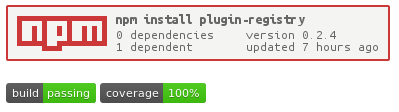
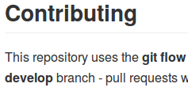

# Software Stewardship

Brendan Graetz

=SLIDE=

- How to be a good "maintainer" of your software project
- In the context of open source software
- Examples in NodeJs, and open source; but principles applicable

=SLIDE=

## Detailed articles

- [blog.bguiz.com/articles/open-source-project-stewardship/general-oss-stewardship](http://blog.bguiz.com/articles/open-source-project-stewardship/general-oss-stewardship/)
- [blog.bguiz.com/articles/open-source-project-stewardship/nodejs-oss-stewardship](http://blog.bguiz.com/articles/open-source-project-stewardship/nodejs-oss-stewardship/)

=SLIDE=

> Services, Tools, Misc

=SUBSLIDE=

## Services

- Github
- Travis
- Coveralls

=SUBSLIDE=

## Tools

- Linting
- Testing
- Coverage
- Documentation

=SUBSLIDE=

## Miscellaneous

- Badges
- Contribution Guidelines
- Publicising

=SLIDE=

> Services

=SUBSLIDE=

## Github

- Git host:
  - Distributed Version Control
- Easy to use & fast
- Pull requests
- Sample: [Profile](https://github.com/bguiz)

=SUBSLIDE=

## Travis

- Continuous integration
- Seamless integration with Github
- Sample:
  [Project](https://travis-ci.org/bguiz/plugin-registry/builds) |
  [Build](https://travis-ci.org/bguiz/plugin-registry/builds/58587512) |
  [Job](https://travis-ci.org/bguiz/plugin-registry/jobs/58587513) |
  [Config](https://github.com/bguiz/plugin-registry/blob/v0.2.4/.travis.yml)

=SUBSLIDE=

## Coveralls

- Code coverage
- Display & tracking only
  - not CI
- Seamless integration with Travis
- Sample:
  [Project](https://coveralls.io/r/bguiz/plugin-registry) |
  [Report](https://coveralls.io/builds/2343053/source?filename=index.js)

=SLIDE=

> Tools

=SUBSLIDE=

## Linting

- Enforcing a code style
- Use JsHint
- [Try It](http://jshint.com/)

=SUBSLIDE=

## Testing

- Verifying that software works
- Detect regressions
- Use jasmine-node
- [Documentation](http://jshint.com/)

=SUBSLIDE=

## Coverage

- Verify that tests touch all of the software
- Identify dead code
- Use Istanbul
- Sample:
  [Report](https://gotwarlost.github.io/istanbul/public/coverage/lcov-report/istanbul/lib/command/common/run-with-cover.js.html)

=SUBSLIDE=

## Documentation

- Generate reference for users
- Use YUIdoc
- Sample:
  [Published](http://bguiz.github.io/plugin-registry/api/0.3/classes/PluginRegistryFluentInterface.html)

=SLIDE=

> Miscellaneous

=SUBSLIDE=

## Badges

- Display the status
- Build status: Travis
- Coverage status: Coveralls
- Package manager: nodei.co
- Sample:
  [Readme](https://github.com/bguiz/plugin-registry#plugin-registry)

=SUBSLIDE=

## Contribution Guidelines

- Instructions
- Expectations
- Make it easy for others to contribute
- Sample:
  [Readme](https://github.com/bguiz/plugin-registry#contributing)

=SUBSLIDE=

## Licence

- Pick one
- tl;dr Legal for neat summaries
- Sample:
  [Readme](https://github.com/bguiz/plugin-registry#licence) |
  [GPLv3](http://www.tldrlegal.com/l/gpl-3.0)

=SUBSLIDE=

## Publicise

- Twitter
- Reddit
- HackerNews
- Sample:
  [Tweet](https://twitter.com/npm_tweets/status/580356577158438913)

=SLIDE=

## Roadblock

- **Problem**: ... but this will take *too long*.
- **Solution**: Iterate, iterate, iterate!

=SUBSLIDE=

- smaller chunks
- reasonable goals
- maintain momentum

=SLIDE=

## Crux

- Software quality
- Automation
- Users --> Contributors

=SLIDE=

> IRL!

[github.com/bguiz/plugin-registry](https://github.com/bguiz/plugin-registry/)

=SLIDE=

> Fin

[blog.bguiz.com/articles/open-source-project-stewardship/general-oss-stewardship](http://blog.bguiz.com/articles/open-source-project-stewardship/general-oss-stewardship/)
